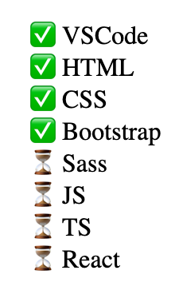
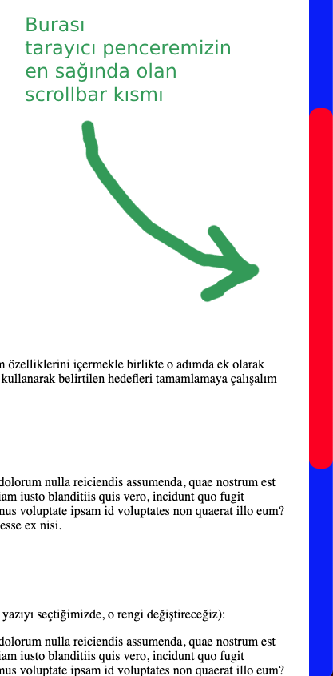

# 🎯 CSS Pseudo & Combinator Görevleri

Bu proje, **OnlyJS Frontend Eğitimi** kapsamında verilen "Pseudo Elements", "Combinators" ve "Custom Scrollbar" konularını uygulamalı olarak öğrenmek için hazırlanmıştır. Sadece HTML ve CSS kullanılarak geliştirilmiştir.

## 📂 İçerik

Projede 3 ana görev bulunmaktadır:

---

### ✅ Görev 1: Liste Öğeleri ve Hover Efekti

```html
<ul id="technologies">
  <li class="checked">VSCode</li>
  <li class="checked">HTML</li>
  <li class="checked">CSS</li>
  <li class="checked">Bootstrap</li>
  <li>Sass</li>
  <li>JS</li>
  <li>TS</li>
  <li>React</li>
</ul>


#### Hedeflenenler:

- `.checked` sınıfına sahip `<li>` öğeleri ✅ ile listelensin.
- Diğer `<li>` öğeleri ⏳ ile listelensin.
- Fare ile üzerine gelinen her madde kırmızı renge dönüşsün.

---

### 🌀 Görev 2: Pseudo Elements

3 adımda ilerlenmiştir:

#### Adım 1:
- İlk paragrafın **ilk satırının** arkaplanı **mavi** yapıldı.

#### Adım 2:
- İkinci paragrafta **kullanıcının seçtiği metinlerin** arkaplanı **yeşil**, yazı rengi **beyaz** oldu.

#### Adım 3:
- Üçüncü paragrafta **ilk harfin** arkaplanı **kırmızı** yapıldı.
- Diğer tüm adımlar da korunarak uygulandı.

---

### 🎯 Görev 3: Custom Scrollbar

Tüm sayfa için özel scrollbar tasarlandı:

- Genişlik: `30px`
- Scrollbar arka plan rengi: **mavi**
- Thumb (tutulan kısım) rengi: **kırmızı**
- Thumb hover durumunda rengi: **mor**
- Thumb’a `border-radius` verildi.

---

## 🖼 Örnek Görseller

| Görev 1 Örneği | Görev 3 Örneği |
|----------------|----------------|
|  |  |

---

## 📁 Klasör Yapısı

```
css-pseudo-combinator-tasks/
│
├── assets/
│   ├── css/
│   │   └── style.css
│   └── img/
│       └── examples/
│           ├── 1.png
│           └── 2.png
│
├── index.html
└── README.md
```

---

## 🚀 Başlatmak İçin

Projeyi kendi bilgisayarınızda çalıştırmak için:

```bash
git clone https://github.com/eylems/css-pseudo-combinator-tasks.git
cd css-pseudo-combinator-tasks
```

Tarayıcınızda `index.html` dosyasını açarak çalışmayı görüntüleyebilirsiniz.

---

## 🧠 Kullanılan Teknolojiler

- HTML5
- CSS3
  - Pseudo Elements (`::before`, `::after`, `::first-line`, `::first-letter`, `::selection`)
  - Combinators
  - Custom Scrollbar

---

